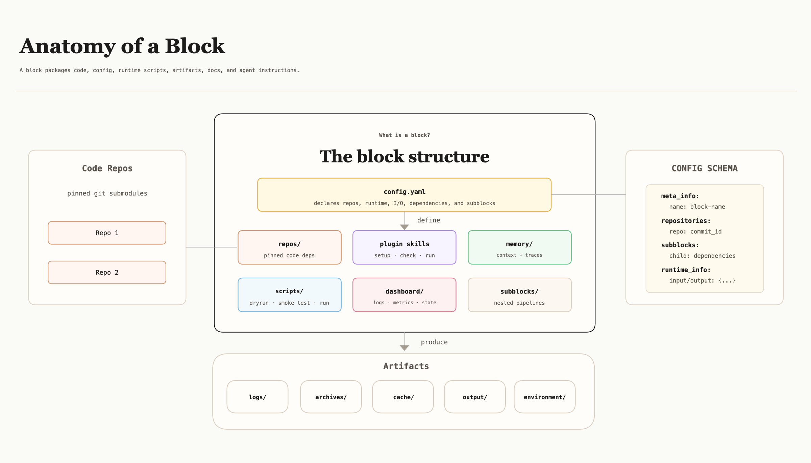

<p align="center">
  <picture>
    <source media="(prefers-color-scheme: dark)" srcset="docs/public/figures/legoflow-wordmark-dark.svg">
    
  </picture>
</p>

**Easy and Interactive Code Data Engineering**

[中文版](./README_zh.md) · [Documentation](https://legoflow-docs.pages.dev/docs) · [License](LICENSE)

---

## About

LegoFlow is an easy and interactive framework for code data engineering, part of the [LegoX](https://legox.pages.dev/) family. The highlights include:

- **Fully Vibe-coding**: LegoFlow turns the complicated, error-prone code data collection procedures (repo and PR collection, task verification, trajectory rollout, and the training-evaluation loop) into well-prepared plugin skills, where users can simply chat and interact with the coding agent (e.g., Claude Code) for real production.
- **Wide Coverage**: LegoFlow covers over 8+ programming languages and 20+ task tags, and trajectory rollouts across multiple coding scaffolds including Claude Code, OpenCode, OpenHands and Terminus.
- **High Flexibility**: LegoFlow is designed to ground on **block**, the building unit that allows your coding agent to manage repositories, scripts, configurations and the runtime output of a particular stage.
- **Live Dashboards**: LegoFlow monitors the data production process through a series of live dashboards. These dashboards are built around carefully designed rubrics for tracking task difficulty, trajectory quality, and model performance.
- **Self-evolving**: An agent has run the whole loop on its own, diagnosed why its first fine-tune plateaued, and lifted `Qwen3.5-35B-A3B-Base` from **7.6% to 64.4% on SWE-bench Verified**. See [the end-to-end run](https://legoflow-docs.pages.dev/docs/running-blocks/cascaded).


## News

🔥 **2026-08-12**: We release LegoFlow v0.1, the initial version of a fully agentic pipeline for software-engineering data.

## Architecture


The pipeline is a tree of **blocks**. The root block orchestrates four children:


| Block                                                                       | What it does                                                                               | Built on                             |
| --------------------------------------------------------------------------- | ------------------------------------------------------------------------------------------ | ------------------------------------ |
| [`blocks/curator`](https://legoflow-docs.pages.dev/docs/blocks/curator)     | Curates high-quality SWE and coding tasks from GitHub PRs, issues, and online forums       | GitHub API, Docker, Claude Agent SDK |
| [`blocks/tracer`](https://legoflow-docs.pages.dev/docs/blocks/tracer)       | Collects high-quality trajectories with verified rewards, across multiple coding scaffolds | Harbor, per-job LiteLLM proxy        |
| [`blocks/trainer`](https://legoflow-docs.pages.dev/docs/blocks/trainer)     | Converts rollout traces into training-ready formats and launches end-to-end training       | LLaMA-Factory, DeepSpeed ZeRO-3      |
| [`blocks/evaluator`](https://legoflow-docs.pages.dev/docs/blocks/evaluator) | Measures checkpoints on coding benchmarks, with rubric and tag level analysis              | Harbor, vLLM                         |


A block owns one stage and is packaged so that both a person and an agent can drive it: `config.yaml` declares what it needs and what it produces, `scripts/` execute it, `artifacts/` hold everything a run leaves behind, and `dashboard/` reads those artifacts without mutating them. The config is one-shot per run, so changing one variable and rerunning is a small reviewable edit. Nothing in the shape is specific to these four blocks, and the root obeys the same contract as everything under it.



For the full contract, see [What is a Block](https://legoflow-docs.pages.dev/docs/block-design).

## Quick Start

You need Claude Code, an OpenAI-compatible LLM endpoint, GitHub token(s) via `GITHUB_TOKENS`, and Docker. Training and self-hosted evaluation also need a GPU node; the validated setup is one node with 8× H800 80GB. Credentials come from the environment, never from a tracked file.

```bash
git clone --recurse-submodules https://github.com/LegoX/SWE-Lego-Live LegoFlow
cd LegoFlow

for b in . blocks/curator blocks/tracer blocks/trainer blocks/evaluator; do
  claude plugin marketplace add "$b/.claude/plugins"
done
for p in root@root-block curator@curator-block tracer@tracer \
         trainer@trainer-block evaluator@evaluator-block; do
  claude plugin install "$p"
done
```

Run `/reload-plugins`, then `/root:setup`. Every block then answers the same four skills: `setup`, `check`, `run`, `dashboard`.

Run the blocks one at a time first ([Running Block by Block](https://legoflow-docs.pages.dev/docs/running-blocks/block-by-block)); once each has run on its own, `/root:run start the data pipeline` drives the whole chain ([Running Cascaded Blocks](https://legoflow-docs.pages.dev/docs/running-blocks/cascaded)).


## Examples

Two ways LegoFlow gets used: one block on its own, and the whole chain driven end to end.

### SWE Task Collection with Curator

The first example is one block on its own. Curator turns real pull requests into tasks that can be graded automatically, and you drive it with three skills rather than by reading its scripts:

```text
/curator:check          # preflight: tokens, LLM endpoint, Docker. No side effects
/curator:collect-prs    # mine candidate PRs from GitHub
/curator:create-tasks   # build each task, then verify it actually grades
```

Collection writes one candidate list per language:

```text
artifacts/collected_prs/python_pr_ids.txt      # tox-dev/tox:pr-3813, ...
```

Creation builds a runnable environment per PR and keeps only what survives verification:

```text
artifacts/swe_tasks/py-cc/
├── tox-dev__tox-3813/
│   ├── instruction.md            # the problem statement the agent sees
│   ├── environment/Dockerfile    # the image the task runs in
│   ├── environment/bug.patch     # reintroduces the bug
│   ├── solution/fix.patch        # the ground-truth fix
│   └── tests/test.sh             # writes the reward
└── verifiable_tasks.txt          # the manifest: only ids that passed
```

A task is admitted only if it grades both ways: the untouched repo must score 0, and the ground-truth fix must score 1. Anything that cannot tell those two apart is not a task worth training on. `verifiable_tasks.txt` is what downstream reads — Tracer stages tasks by filtering through that manifest, never by scanning the directory.

See [Curator](https://legoflow-docs.pages.dev/docs/blocks/curator).

### End-to-End Result

The second example is the whole pipeline at once. An agent was given one brief — build Python SWE data, train a base model on it, and measure the result — and it ran all four blocks itself, pausing at each approval gate. What came out of each stage:


| Stage     | Output                                                                                       |
| --------- | -------------------------------------------------------------------------------------------- |
| Curator   | 4,166 verified Python tasks.                                                                 |
| Tracer    | 915 solved rollouts, kept with their verified rewards.                                       |
| Selection | 512 trajectories, filtered for reasoning depth rather than coverage.                         |
| Trainer   | One full-parameter fine-tune of `Qwen3.5-35B-A3B-Base`, loss converging from 0.524 to 0.229. |
| Evaluator | 64.4% on the 500 SWE-bench Verified tasks, against 7.6% for the untrained base model.        |


The interesting number is not the last one. A first attempt over the same rollout pool, selected for reasoning coverage, reached 56.1%. The agent read that result, changed the trajectory selection rule to reasoning depth, and reran only the stages that change affected: 64.4%. Same teacher model, same tasks, same training recipe.

Exact tasks, trajectories and scores will not repeat bit for bit. What LegoFlow makes reproducible is procedural: declared dependencies make every handoff explicit, run archives preserve the configuration and code that produced a result, and the uniform lifecycle lets you rerun one stage without disturbing the rest. The full brief and the per-stage expectations are in [Running Cascaded Blocks](https://legoflow-docs.pages.dev/docs/running-blocks/cascaded).

## Open-source Data Collection

Datasets produced by LegoFlow and released for reuse. Every row names the teacher model that generated the trajectories, the scaffold they were rolled out in, and the result of training on them.


| ID                  | Teacher Model | Scaffold      | Data Samples | Training Result                                           | HF Link                                                                                                 |
| ------------------- | ------------- | ------------- | ------------ | --------------------------------------------------------- | ------------------------------------------------------------------------------------------------------- |
| `swe-sft-512-glm52` | GLM-5.2       | OpenHands SDK | 512          | `Qwen3.5-35B-A3B-Base` 7.6% → 64.4% on SWE-bench Verified | [samples_for_llama_factory_sft](https://huggingface.co/datasets/SWE-Lego/samples_for_llama_factory_sft) |


## Roadmap

We are actively expanding LegoFlow with more features and data pipelines, including more tasks, more scaffolds, and recursive self-improvement. Stay tuned!

Known gaps, stated plainly:

- `/root:dashboard`, a single cross-block board, is still a stub. Use the four per-block dashboards.
- Multi-node training is not wired up. The shipped ZeRO-3 config assumes one 8-GPU node.
- Root `scripts/start.sh` automates the data stage only, Curator and Tracer. The full four-block chain is agent-driven through `/root:run`.
- 11 benchmarks are validated against Harbor's registry. The remaining entries are unverified with this agent.
- Configuration reference is spread across four per-block Configuration Guides. There is no consolidated reference page and no changelog yet.


## Contributing

Issues and pull requests are welcome on [GitHub](https://github.com/LegoX/SWE-Lego-Live).

New stages are scaffolded with `/root:create`, which produces the full directory tree wired to the block contract. A block is finished when `check` passes on a fresh clone, a run archives itself, and another block can consume its output without being told a path by hand. See [Adding Your Own Block](https://legoflow-docs.pages.dev/docs/block-design).

## Citation

```bibtex
@misc{legoflow2026,
  title  = {LegoFlow: An Agentic Pipeline for Coding-Agent Data},
  author = {The LegoX Team},
  year   = {2026},
  url    = {https://github.com/LegoX/SWE-Lego-Live}
}
```


## Acknowledgements

LegoFlow builds on [Harbor](https://www.harborframework.com/) for isolated task execution,
[LLaMA-Factory](https://github.com/LegoX/LLaMA-Factory) and [DeepSpeed](https://github.com/deepspeedai/DeepSpeed) for training,
[LiteLLM](https://github.com/BerriAI/litellm) for trajectory capture,
[vLLM](https://github.com/vllm-project/vllm) for serving local checkpoints,
[Claude Code](https://claude.com/claude-code) and the Claude Agent SDK for agent operation,
and [Fumadocs](https://fumadocs.dev/) for the documentation site.

## License

Apache License 2.0. See [LICENSE](LICENSE).