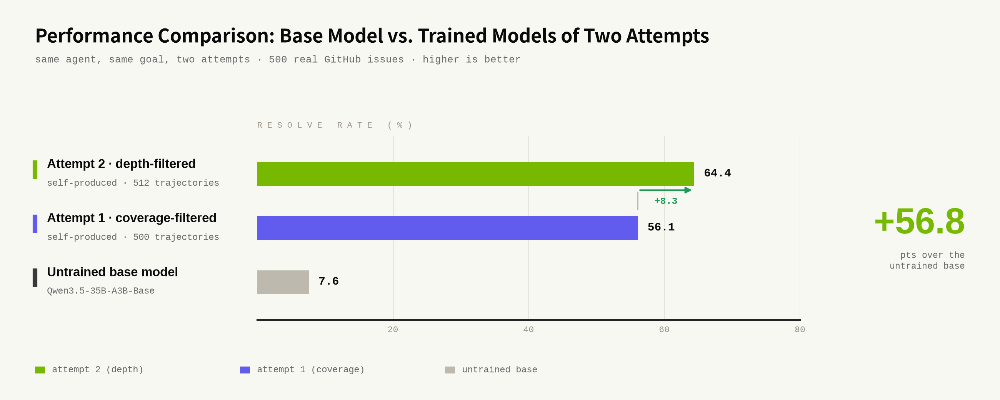
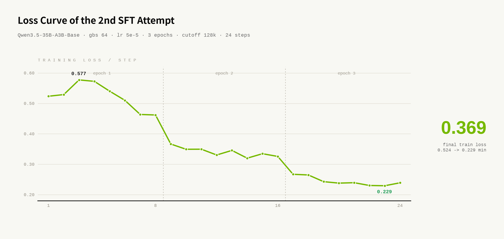

# LegoFlow

[中文版](./README_zh.md)

[](https://legoflow-docs.pages.dev/docs)
[](LICENSE)

**LegoFlow** is an agentic pipeline for coding-agent data. It curates verified SWE tasks from real GitHub repositories, rolls agents out against them, converts the trajectories into training data, fine-tunes, and evaluates. Every stage follows the same contract, so a person and an agent operate it the same way.

An agent ran that whole loop on its own, diagnosed why its first fine-tune plateaued, and lifted a base model from **7.6% to 64.4% on SWE-bench Verified**.

[Documentation](https://legoflow-docs.pages.dev/docs) ·
[Motivation](https://legoflow-docs.pages.dev/docs/motivation) ·
[Getting Started](https://legoflow-docs.pages.dev/docs/getting-started) ·
[Case Study](https://legoflow-docs.pages.dev/docs/running-blocks/cascaded)

## News

- **2026-08-12** — Docs reworked around design principles and reader intent. The site is live at [legoflow-docs.pages.dev](https://legoflow-docs.pages.dev/docs).
- **2026-08-11** — End-to-end agent-driven run published: 7.6% → 64.4% on SWE-bench Verified. See [Running Cascaded Blocks](https://legoflow-docs.pages.dev/docs/running-blocks/cascaded).
- **2026-08-10** — Unified live dashboards across all four blocks, publishable to Cloudflare Pages.

## Key Features

- **Fully agentic data workflow.** Curated SWE tasks across 8+ programming languages and 20+ tags, then rollouts across multiple coding scaffolds including Claude Code, OpenCode, OpenHands and Terminus.
- **Every handoff is declared.** A consumer names the upstream output that feeds each of its own inputs, and the producer mirrors it. `scripts/validate_config.py` cross-checks both directions at preflight, so a broken handoff fails before a multi-hour job starts.
- **Every run is archived.** An exit trap snapshots the config and the scripts as they were, on success, failure or signal. `artifacts/index.yaml` is the timeline; the newest entry is the live state.
- **Live dashboards per block.** Each board reads that block's `artifacts/` directly, with no separate database, so it is always as current as the files on disk.

## Architecture


The pipeline is a tree of **blocks**. The root block orchestrates four children:

| Block | What it does | Built on |
|---|---|---|
| [`blocks/curator`](https://legoflow-docs.pages.dev/docs/blocks/curator) | Curates high-quality SWE and coding tasks from GitHub PRs, issues, and online forums | GitHub API, Docker, Claude Agent SDK |
| [`blocks/tracer`](https://legoflow-docs.pages.dev/docs/blocks/tracer) | Collects high-quality trajectories with verified rewards, across multiple coding scaffolds | Harbor, per-job LiteLLM proxy |
| [`blocks/trainer`](https://legoflow-docs.pages.dev/docs/blocks/trainer) | Converts rollout traces into training-ready formats and launches end-to-end training | LLaMA-Factory, DeepSpeed ZeRO-3 |
| [`blocks/evaluator`](https://legoflow-docs.pages.dev/docs/blocks/evaluator) | Measures checkpoints on coding benchmarks, with rubric and tag level analysis | Harbor, vLLM |

A block owns one stage and is packaged so that both a person and an agent can drive it: `config.yaml` declares what it needs and what it produces, `scripts/` execute it, `artifacts/` hold everything a run leaves behind, and `dashboard/` reads those artifacts without mutating them. The config is one-shot per run, so changing one variable and rerunning is a small reviewable edit. Nothing in the shape is specific to these four blocks, and the root obeys the same contract as everything under it.

For the full contract, see [What is a Block](https://legoflow-docs.pages.dev/docs/block-design).

## Quick Start

### Prerequisites

- Claude Code, the recommended way to operate LegoFlow.
- An OpenAI-compatible LLM endpoint for Curator, Tracer and Evaluator jobs.
- GitHub token(s), supplied through `GITHUB_TOKENS`, used by Curator when collecting pull requests.
- Docker on the run host.
- A GPU node, only for training or for evaluating a self-hosted checkpoint. The validated setup is one node with 8× H800 80GB. Multi-node training is not wired up.
- Optional Docker and Cloudflare credentials, for authenticated image pulls and for publishing dashboards.

Credentials come from the environment, never from a tracked file. Do not put secrets in any `config.yaml`.

### 1. Clone

```bash
git clone --recurse-submodules https://github.com/SWE-Lego/SWE-Lego-Live LegoFlow
cd LegoFlow
```

If you already cloned without `--recurse-submodules`, run `git submodule update --init --recursive`.

### 2. Install the plugins

Register each local plugin directory as a Claude Code marketplace, from the repository root:

```bash
claude plugin marketplace add ./.claude/plugins
claude plugin marketplace add ./blocks/curator/.claude/plugins
claude plugin marketplace add ./blocks/tracer/.claude/plugins
claude plugin marketplace add ./blocks/trainer/.claude/plugins
claude plugin marketplace add ./blocks/evaluator/.claude/plugins
```

Then install one plugin from each marketplace:

```bash
claude plugin install root@root-block
claude plugin install curator@curator-block
claude plugin install tracer@tracer
claude plugin install trainer@trainer-block
claude plugin install evaluator@evaluator-block
```

Run `/reload-plugins` once in an active session, or restart it. Keep the marketplace paths relative as written above.

### 3. Set up the workspace

```text
/root:setup
```

It checks shared tooling, verifies the root `config.yaml`, and can walk into each child block's setup flow. It does not launch anything.

### 4. Run block by block

This is the recommended path. Every block follows the same lifecycle: `setup` prepares dependencies, `check` validates without side effects, `run` does the work and archives it, and `dashboard` inspects the result.

```text
/curator:setup   → /curator:check   → /curator:collect-prs → /curator:create-tasks → /curator:dashboard
/tracer:setup    → /tracer:check    → /tracer:run          → /tracer:dashboard
/trainer:setup   → /trainer:check   → /trainer:run         → /trainer:dashboard
/evaluator:setup → /evaluator:check → /evaluator:run       → /evaluator:dashboard
```

A `check` that fails before a run is working as designed. It is there to stop a costly collection, rollout, training or evaluation job before it starts. See [Running Block by Block](https://legoflow-docs.pages.dev/docs/running-blocks/block-by-block).

### 5. Run the chain from the root

Once each block has run at least once on its own:

```text
/root:setup
/root:check
/root:run start the data pipeline
```

You describe the target, not the steps. The chain pauses at approval gates and archives each stage as it goes. Two things to know: the root does not collect PRs, so run `/curator:collect-prs` first and let it finish; and `check → confirm → run` is mandatory, because no agent should launch a multi-hour GPU job without you saying so. See [Running Cascaded Blocks](https://legoflow-docs.pages.dev/docs/running-blocks/cascaded).

## End-to-End Result

One agent-driven run of the full chain, on Python tasks only:

| Stage | Output |
|---|---|
| Curator | 4,166 verified Python tasks. |
| Tracer | 915 solved rollouts, kept with their verified rewards. |
| Selection | 512 trajectories, filtered for reasoning depth rather than coverage. |
| Trainer | One full-parameter fine-tune of `Qwen3.5-35B-A3B-Base`, loss converging from 0.524 to 0.229. |
| Evaluator | 64.4% on the 500 SWE-bench Verified tasks, against 7.6% for the untrained base model. |

<p align="center">
  
  
</p>

The interesting number is not the last one. A first attempt over the same rollout pool, selected for reasoning coverage, reached 56.1%. The agent read that result, changed the trajectory selection rule to reasoning depth, and reran only the stages that change affected: 64.4%. Same teacher model, same tasks, same training recipe.

Exact tasks, trajectories and scores will not repeat bit for bit. What LegoFlow makes reproducible is procedural: declared dependencies make every handoff explicit, run archives preserve the configuration and code that produced a result, and the uniform lifecycle lets you rerun one stage without disturbing the rest. The full brief and the per-stage expectations are in [Running Cascaded Blocks](https://legoflow-docs.pages.dev/docs/running-blocks/cascaded).

## Documentation

| I want to… | Go to |
|---|---|
| Understand why this exists | [Motivation](https://legoflow-docs.pages.dev/docs/motivation) |
| Install it and run something | [Getting Started](https://legoflow-docs.pages.dev/docs/getting-started) |
| Run one stage at a time | [Running Block by Block](https://legoflow-docs.pages.dev/docs/running-blocks/block-by-block) |
| Run the whole chain from the root | [Running Cascaded Blocks](https://legoflow-docs.pages.dev/docs/running-blocks/cascaded) |
| Build verified SWE tasks from GitHub | [Curator](https://legoflow-docs.pages.dev/docs/blocks/curator) |
| Collect agent trajectories on tasks I already have | [Tracer](https://legoflow-docs.pages.dev/docs/blocks/tracer) |
| Fine-tune a model on trajectories | [Trainer](https://legoflow-docs.pages.dev/docs/blocks/trainer) |
| Benchmark a model or a checkpoint | [Evaluator](https://legoflow-docs.pages.dev/docs/blocks/evaluator) |
| Add a block of my own | [What is a Block](https://legoflow-docs.pages.dev/docs/block-design) |
| Something went wrong | [Q&A](https://legoflow-docs.pages.dev/docs/qa) |

## Roadmap

Known gaps, stated plainly:

- `/root:dashboard`, a single cross-block board, is still a stub. Use the four per-block dashboards.
- Multi-node training is not wired up. The shipped ZeRO-3 config assumes one 8-GPU node.
- Root `scripts/start.sh` automates the data stage only, Curator and Tracer. The full four-block chain is agent-driven through `/root:run`.
- 11 benchmarks are validated against Harbor's registry. The remaining entries are unverified with this agent.
- Configuration reference is spread across four per-block Configuration Guides. There is no consolidated reference page and no changelog yet.

## Contributing

Issues and pull requests are welcome on [GitHub](https://github.com/SWE-Lego/SWE-Lego-Live).

New stages are scaffolded with `/root:create`, which produces the full directory tree wired to the block contract. A block is finished when `check` passes on a fresh clone, a run archives itself, and another block can consume its output without being told a path by hand. See [Adding Your Own Block](https://legoflow-docs.pages.dev/docs/block-design).

## Citation

```bibtex
@misc{legoflow2026,
  title  = {LegoFlow: An Agentic Pipeline for Coding-Agent Data},
  author = {The LegoFlow Team},
  year   = {2026},
  url    = {https://github.com/SWE-Lego/SWE-Lego-Live}
}
```

## Acknowledgements

LegoFlow builds on [Harbor](https://www.harborframework.com/) for isolated task execution,
[LLaMA-Factory](https://github.com/SWE-Lego/LLaMA-Factory) and [DeepSpeed](https://github.com/deepspeedai/DeepSpeed) for training,
[LiteLLM](https://github.com/BerriAI/litellm) for trajectory capture,
[vLLM](https://github.com/vllm-project/vllm) for serving local checkpoints,
[Claude Code](https://claude.com/claude-code) and the Claude Agent SDK for agent operation,
and [Fumadocs](https://fumadocs.dev/) for the documentation site.

## License

Apache License 2.0. See [LICENSE](LICENSE).
