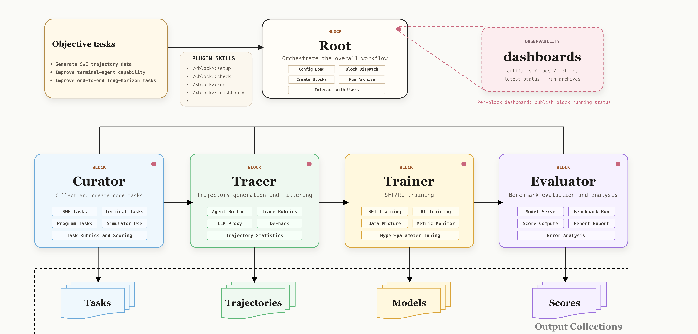

<p align="center">
  <picture>
    <source media="(prefers-color-scheme: dark)" srcset="docs/public/figures/legoflow-wordmark-dark.svg">
    
  </picture>
</p>

<p align="center"><b>Easy and Interactive Code Data Engineering</b></p>

<p align="center">
  <a href="https://legoflow-docs.pages.dev/docs"> Docs</a>
  &nbsp;·&nbsp;
  <a href="https://huggingface.co/Lego-X"> HuggingFace</a>
  &nbsp;·&nbsp;
  <a href="https://legox.pages.dev/blog/legoflow/"> Blog</a>
  &nbsp;·&nbsp;
  <a href="https://legox.pages.dev/"> LegoX</a>
  &nbsp;·&nbsp;
  <a href="LICENSE"> License</a>
  &nbsp;·&nbsp;
  <a href="./README_zh.md"> ZH</a>
</p>

---


## About

LegoFlow is an easy and interactive framework for code data engineering, part of the [LegoX](https://legox.pages.dev/) family. The highlights include:

- **Fully Vibe-coding**: LegoFlow turns the complicated, error-prone code data collection procedures (repo and PR collection, task verification, trajectory rollout, and the training-evaluation loop) into well-prepared plugin skills, where users can simply chat and interact with the coding agent (e.g., Claude Code) for real production.
- **Wide Coverage**: LegoFlow covers over 8+ programming languages and 20+ task tags, and trajectory rollouts across multiple coding scaffolds including Claude Code, OpenCode, OpenHands and Terminus.
- **High Flexibility**: LegoFlow is designed to ground on **block**, the building unit that allows your coding agent to manage repositories, scripts, configurations and the runtime output of a particular stage.
- **Live Dashboards**: LegoFlow monitors the data production process through a series of live dashboards. These dashboards are built around carefully designed rubrics for tracking task difficulty, trajectory quality, and model performance.
- **Self-evolving**: An agent has run the whole loop on its own, diagnosed why its first fine-tune plateaued, and lifted `Qwen3.5-35B-A3B-Base` from **7.6% to 64.4% on SWE-bench Verified**. See [the end-to-end run](https://legox.pages.dev/blog/legoflow/).


## News

🔥 **2026-08-12**: We release LegoFlow v0.1, the initial version of a fully agentic pipeline for software-engineering data.

## Architecture



LegoFlow follows the tree structure of **blocks**. The root orchestrates four children:


| Block | Role |
| ----- | ---- |
| [`curator`](https://legoflow-docs.pages.dev/docs/blocks/curator/getting-started) | Curates high-quality SWE and coding tasks from GitHub PRs, issues, and online forums |
| [`tracer`](https://legoflow-docs.pages.dev/docs/blocks/tracer/getting-started) | Collects high-quality trajectories with verified rewards, across multiple coding scaffolds |
| [`trainer`](https://legoflow-docs.pages.dev/docs/blocks/trainer/getting-started) | Converts rollout traces into training-ready formats and launches end-to-end training |
| [`evaluator`](https://legoflow-docs.pages.dev/docs/blocks/evaluator/getting-started) | Measures checkpoints on coding benchmarks, with rubric and tag level analysis |


> [!NOTE]
> We have a clear definition of **block**. It plays a particular role in the workflow, following the same layout and file structure. A block maintains the relevant repositories (`repos/`), configuration (`config.yaml`) and run scripts (`scripts/`), manages its output in `artifacts/`, and communicates with its adjacent blocks. See [What is a Block](https://legoflow-docs.pages.dev/docs/development/block-design) for more details.

## Released Datasets

We are actively releasing the latest datasets produced by LegoFlow:


| ID                  | Teacher Model | Scaffold      | Data Samples | Training Result                                           | HF Link                                                                                                 |
| ------------------- | ------------- | ------------- | ------------ | --------------------------------------------------------- | ------------------------------------------------------------------------------------------------------- |
| `swe-sft-512-glm52` | GLM-5.2       | OpenHands SDK (v1.14) | 512          | `Qwen3.5-35B-A3B-Base` 7.6% → 64.4% on SWE-bench Verified | <a href="https://huggingface.co/datasets/Lego-X/samples_for_llama_factory_sft"> samples_for_llama_factory_sft</a> |


## Quick Start

### Prerequisites

- **Claude Code** — the recommended coding agent to drive LegoFlow.
- **An OpenAI-compatible LLM endpoint** — required by Curator, Tracer and Evaluator.
- **GitHub token(s)** — supplied through `GITHUB_TOKENS`, for Curator's PR collection.
- **Docker** — every task and every rollout runs in a container.
- **A GPU node** — only if you train, or serve a checkpoint yourself. Validated on one node with 8× H800 80GB; multi-node is not wired up.
- **Docker and Cloudflare credentials** — optional, for authenticated image pulls and for publishing dashboards.

What each one is for is spelled out in [Getting Started](https://legoflow-docs.pages.dev/docs/getting-started). Each block has its own dependent environment, which can be set up automatically following the corresponding guides. 

### Environment Setup
1. Clone the code repository.
```bash
git clone --recurse-submodules https://github.com/LegoX/LegoFlow LegoFlow
cd LegoFlow
```

2. Install the plugins. Every block ships one. Register its directory as a Claude Code marketplace, then install from it:

```bash
claude plugin marketplace add ./.claude/plugins
claude plugin install root@root-block
```

   The same holds for `curator`, `tracer`, `trainer` and `evaluator`, whose plugin directories live at `./blocks/<name>/.claude/plugins`. All five pairs are listed in [Getting Started](https://legoflow-docs.pages.dev/docs/getting-started). Run `/reload-plugins` afterwards so the skills load.

### Example Usages

Users can trigger individual blocks for a particular purpose, or jointly run multiple blocks for a more complicated pipeline.

#### Running Individual Blocks

Every block has clear roles and functions. Users can easily trigger these blocks with their pre-defined skills. In general, the steps to trigger a block include:

- `/block:setup` prepares necessary dependencies and fills in `config.yaml`
- `/block:check` validates the configuration and run pre-flight check
- `/block:run` does the work and archives the intermediate output to `artifacts/`
- `/block:dashboard` helps the user to monitor the running progress and status

The detailed guides to each individual block can be found at [docs](https://docs-dev.legoflow-docs.pages.dev/docs/running-blocks/block-by-block).

#### Running Multiple Blocks

Users can also customize the workflow by running multiple blocks. Step-by-step guidance is in [Running Cascaded Blocks](https://docs-dev.legoflow-docs.pages.dev/docs/running-blocks/cascaded).

For example, our previous run with all four blocks shows that Curator built 4,166 verified Python tasks, Tracer solved 915 of them, 512 trajectories were selected for training, and the resulting fine-tune lifted `Qwen3.5-35B-A3B-Base` from **7.6% to 64.4%** on SWE-bench Verified. More details are recorded in the [blog](https://legox.pages.dev/blog/legoflow/).

## Contributing

We welcome all developers to use, improve and contribute to LegoFlow. Issues and pull requests go on [GitHub](https://github.com/LegoX/LegoFlow). For more details, please refer to the [Development guide](https://docs-dev.legoflow-docs.pages.dev/docs/development).

## Citation

```bibtex
@misc{legoflow2026,
  title  = {LegoFlow: An Agentic Pipeline for Coding-Agent Data},
  author = {The LegoX Team},
  year   = {2026},
  url    = {https://github.com/LegoX/LegoFlow}
}
```


## Acknowledgements

LegoFlow builds on [Harbor](https://www.harborframework.com/) for isolated task execution,
[LLaMA-Factory](https://github.com/LegoX/LLaMA-Factory) and [DeepSpeed](https://github.com/deepspeedai/DeepSpeed) for training,
[LiteLLM](https://github.com/BerriAI/litellm) for trajectory capture,
[vLLM](https://github.com/vllm-project/vllm) for serving local checkpoints,
[Claude Code](https://claude.com/claude-code) and the Claude Agent SDK for agent operation,
and [Fumadocs](https://fumadocs.dev/) for the documentation site.

## License

Apache License 2.0. See [LICENSE](LICENSE).
